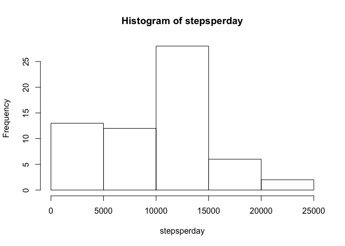
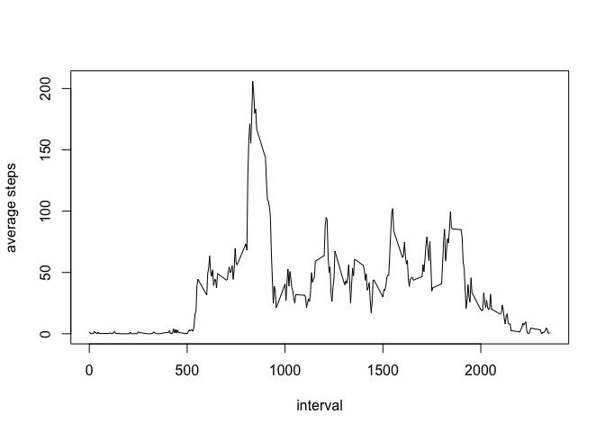
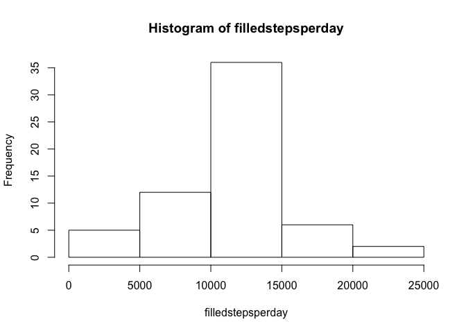
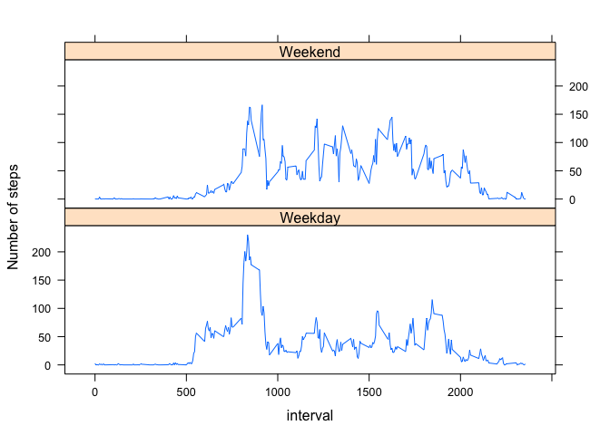

# Reproducible Research: Peer Assessment 1


## Loading and preprocessing the data
The following unzips and loads the data


```r
unzip("activity.zip")
activity<-read.csv("activity.csv",header=TRUE, stringsAsFactors=FALSE)
```


## What is mean total number of steps taken per day?

Calculate the total number of steps taken per day, plot a histogram, and calculate mean and median total steps per day.


```r
stepsperday<-tapply(activity$steps, activity$date, sum, na.rm=TRUE)
hist(stepsperday)
```

<!-- -->

```r
mean(stepsperday, na.rm=TRUE)
```

```
## [1] 9354.23
```

```r
median(stepsperday, na.rm=TRUE)
```

```
## [1] 10395
```

## What is the average daily activity pattern?
Calcuate the average number of steps per time interval, and plot as time series.   Determine the time interval with the highest average steps per day.

```r
averagestepsperinterval<-tapply(activity$steps, activity$interval, mean, na.rm=TRUE)
plot(names(averagestepsperinterval),averagestepsperinterval, type="l", xlab="interval", ylab="average steps")
```

<!-- -->

```r
averagestepsperinterval[which.max(averagestepsperinterval)]
```

```
##      835 
## 206.1698
```

## Imputing missing values

Calculate and report the total number of rows with NAs.


```r
ncc<-activity[!complete.cases(activity),]
nrow(ncc)
```

```
## [1] 2304
```
Our method for inserting missing values will be average of time interval.


```r
 asdf<-data.frame(interval=as.integer(names(averagestepsperinterval)), averagesteps=averagestepsperinterval)
 mergedActivity<-merge(activity,asdf,by.x="interval",by.y="interval",all=TRUE)
 mergedActivity[which(is.na(mergedActivity$steps)),2]<-mergedActivity[which(is.na(mergedActivity$steps)),4]
```
Now we will make another histogram and calculate mean and median with the missing values filled in


```r
filledstepsperday<-tapply(mergedActivity$steps, mergedActivity$date, sum, na.rm=TRUE)
hist(filledstepsperday)
```

<!-- -->

```r
mean(filledstepsperday, na.rm=TRUE)
```

```
## [1] 10766.19
```

```r
median(filledstepsperday, na.rm=TRUE)
```

```
## [1] 10766.19
```
As we can see filling in missing values increases mean and median steps per day.


## Are there differences in activity patterns between weekdays and weekends?

First create a factor indicating whether a given date is a Weekend or Weekday


```r
 mergedActivity$Weekday<-weekdays(as.Date(mergedActivity$date))
 mergedActivity$Weekday[mergedActivity$Weekday=="Saturday" | mergedActivity$Weekday=="Sunday"]<-"Weekend"
 mergedActivity$Weekday[mergedActivity$Weekday!="Weekend"]<-"Weekday"
```

then make a panel plot to show average steps per weekend/weekday time interval.


```r
library(lattice)
library(dplyr)
```

```
## 
## Attaching package: 'dplyr'
```

```
## The following objects are masked from 'package:stats':
## 
##     filter, lag
```

```
## The following objects are masked from 'package:base':
## 
##     intersect, setdiff, setequal, union
```

```r
graphtable<-mergedActivity%>%group_by(interval, Weekday)%>% summarise(average=mean(steps))
xyplot(average~interval | Weekday, data = graphtable, type="l", layout=c(1,2), ylab="Number of steps")
```

<!-- -->
